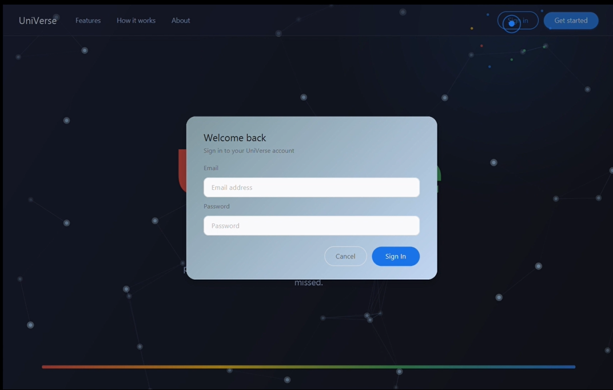
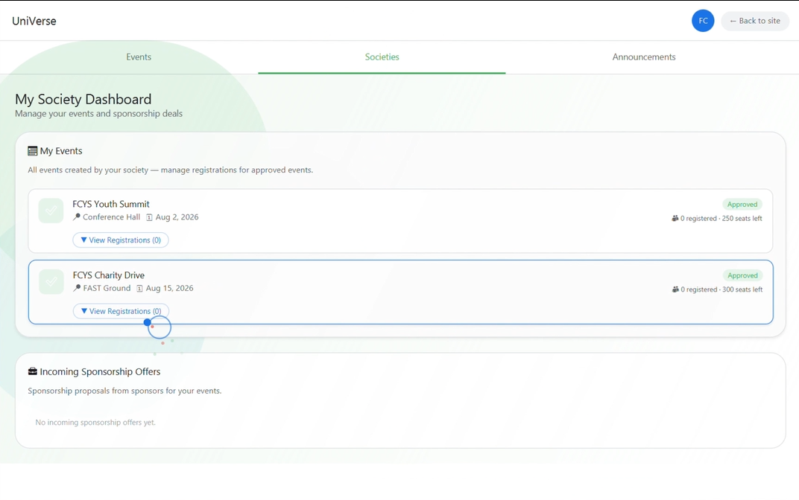
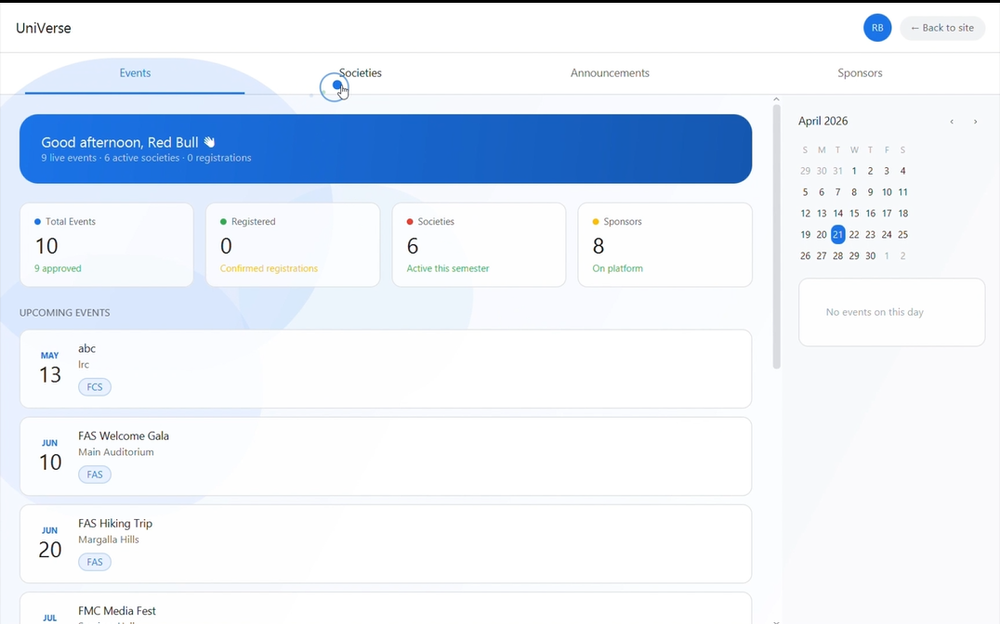
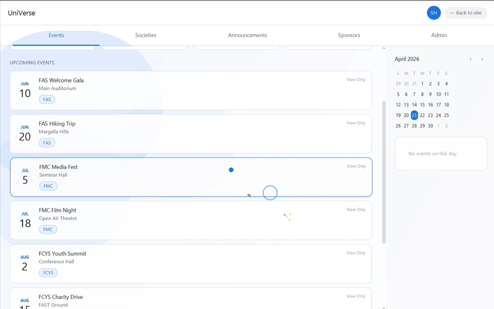
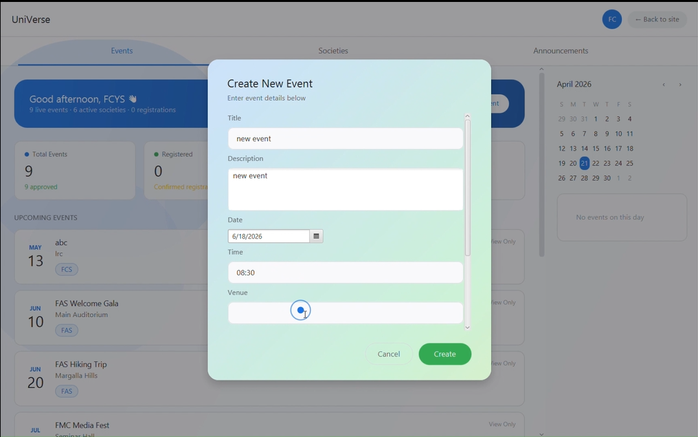

<div align="center">

# UniVerse

**A Role-Based University Event & Society Management Platform**

A JavaFX desktop application for managing university events, societies, sponsorships, and notifications through role-based dashboards with an animated, modern UI.

[](https://openjdk.org/)
[](https://openjfx.io/)
[](https://maven.apache.org/)
[](https://www.microsoft.com/en-us/sql-server)

</div>

---

## Overview

**UniVerse** is a desktop platform that centralizes the full lifecycle of university events from society registration and event proposals, through admin approval workflows, to student registration and sponsorship deal management. A real-time notification system connects all stakeholders.

The system supports four distinct user roles **Student**, **Society**, **Sponsor**, and **Admin** each with dedicated dashboards, tailored workflows, and role based access control (RBAC).

---

## Highlights

- **Role-Based Access Control**: Four distinct user roles with dynamically scoped dashboards and permissions
- **Layered MVC Architecture**: Clean separation across presentation, business logic, domain model, and data access layers
- **Event Approval Pipeline**: Multi-stage workflow with society submission, admin review, and automated stakeholder notifications
- **Sponsorship Workflow**: End-to-end proposal lifecycle with duplicate-prevention constraints and status tracking
- **Real-Time Notification System**: Polymorphic notification dispatch triggered by state changes across the platform
- **SQL Server Integration**: Normalized 13-table relational schema with referential integrity and constraint-enforced enums
- **UML-Driven Design**: System designed through use case analysis, domain modeling, and class/sequence diagramming prior to implementation

---

## Application Preview

<p align="center">
  <video src="assets/DEMO.mp4" alt="UniVerse Demo" width="100%" controls></video>
</p>

---

## Features

### Student Portal
- Browse and register for approved events with real-time seat availability
- View registration history with status tracking (Confirmed / Cancelled)
- Expandable event detail cards displaying venue, date, deadline, and capacity
- Receive notifications for event updates and capacity alerts

### Society Management
- Create and submit events for admin approval
- Post announcements visible to all platform users
- Manage event lifecycle (Pending → Approved → Completed)
- Review and respond to incoming sponsorship proposals
- Track member engagement through registration metrics

### Sponsor Dashboard
- Browse live events and submit sponsorship proposals
- Track deal status (Pending / Accepted / Rejected)
- One-proposal-per-event enforcement to prevent duplicates

### Admin Panel
- Approve, reject, or cancel events with single-action controls
- Manage society statuses (Activate / Suspend)
- Platform-wide statistics dashboard covering events, registrations, societies, and sponsors
- Automated notification dispatch on every approval action

### Interface & Interaction Features
- Animated landing page with particle-based intro sequence and constellation background
- Custom cursor system with particle trails and click burst effects
- Smooth view transitions using fade and translate animations
- Themed modal dialogs for login, registration, event creation, and sponsorship proposals
- Interactive calendar with event markers and day-detail view
- Toast notification system for real-time user feedback
- Ambient animated background elements across all dashboard panels

---

## Architecture

The application follows a **layered MVC architecture** with clear separation of concerns across four layers:

```
┌─────────────────────────────────────────────────────────┐
│                   Presentation Layer                    │
│     FXML Views  ·  Controllers (JavaFX)  ·  CSS Styles  │
├─────────────────────────────────────────────────────────┤
│                   Business Logic Layer                  │
│     UserService  ·  EventService  ·  SocietyService     │
│     RegistrationService · SponsorshipService            │
│     AnnouncementService · NotificationService           │
├─────────────────────────────────────────────────────────┤
│                   Domain Model Layer                    │
│     User (abstract) → Student, Society, Sponsor, Admin  │
│     Event · EventRegistration · Announcement            │
│     SponsorshipDeal · Notification · Session            │
├─────────────────────────────────────────────────────────┤
│                   Data Access Layer                     │
│     DBConnection (Singleton) → MS SQL Server via JDBC   │
└─────────────────────────────────────────────────────────┘
```

---

## Tech Stack

| Layer              | Technology                                |
|--------------------|-------------------------------------------|
| **Language**       | Java 17                                   |
| **UI Framework**   | JavaFX 17.0.2 (FXML + CSS)                |
| **Build Tool**     | Apache Maven 3.x                          |
| **Database**       | Microsoft SQL Server 2019+ (JDBC)         |
| **Authentication** | Windows Integrated Security               |
| **Module System**  | Java Platform Module System (JPMS)        |

---

## Design Patterns

| Pattern              |                                                Application                                                  |
|----------------------|-------------------------------------------------------------------------------------------------------------|
| **Singleton**        | `DBConnection` ensures a single database connection instance; `Session` manages the authenticated user globally    |
| **MVC**              | FXML views, controller classes, and service/model separation enforce clean architectural boundaries            |
| **Template Method**  | Abstract `User` class defines `login()` / `logout()` contracts; subclasses provide role-specific behavior      |
| **Observer**         | Notification system dispatches alerts to relevant recipients on state changes                                  |
| **Factory Method**   | `Society.createEvent()` and `Sponsor.submitProposal()` encapsulate entity creation with validation            |
| **RBAC**             | Tab visibility and action permissions adapt dynamically based on the authenticated user's role                 |

---

## Database Design

The application uses a **normalized relational schema** with 13 tables. The diagram below shows the primary entity relationships:

```
University ──┬── Department
             ├── Admin
             ├── Student ──── EventRegistration ──── Event
             └── Society ──┬── Event ──── SponsorshipDeal ──── Sponsor
                           └── Announcement

Notification (polymorphic recipient: Student | Society | Sponsor | Admin)
SharedCalendar ──── Event
EventSummary ──── Event
```

**Key design decisions:**

- **Polymorphic notifications** — `recipientType` + `recipientID` columns enable a single notification table to serve all user roles
- **Constraint-enforced enums** — `CHECK` constraints enforce valid status values at the database level
- **Referential integrity** — Foreign keys enforce relationships across all entity associations
- **Duplicate prevention** — Unique constraints prevent duplicate event registrations and sponsorship proposals

> The full SQL schema is available in [`universe_db.sql`](UniVerse/universe_db.sql).

---

## Getting Started

### Prerequisites

| Requirement      | Version                                    |
|------------------|-------------------------------------------|
| **JDK**          | 17 or higher                               |
| **Maven**        | 3.x                                        |
| **SQL Server**   | 2019+ (with Windows Authentication enabled)|

### 1. Clone the Repository

```bash
git clone https://github.com/Mitul-Dial/UniVerse.git
cd UniVerse
```

### 2. Set Up the Database

1. Open **SQL Server Management Studio (SSMS)**
2. Execute the schema script located at `UniVerse/universe_db.sql`
3. This creates the `universe_db` database with all tables, constraints, and relationships

### 3. Configure the Connection

The application uses **Windows Integrated Authentication** by default. To modify the connection, update the connection string in [`DBConnection.java`](UniVerse/src/main/java/com/universe/db/DBConnection.java):

```java
private static final String URL =
    "jdbc:sqlserver://localhost;databaseName=universe_db;integratedSecurity=true;encrypt=false;";
```

> **Note:** JDBC authentication DLLs (`mssql-jdbc_auth-*.dll`) are included in the project for Windows Integrated Authentication support.

### 4. Build & Run

```bash
cd UniVerse

# Install dependencies and compile
mvn clean install

# Launch the application
mvn javafx:run
```

The application launches at **1280×800** resolution (minimum 1024×700).

---

## Project Structure

```
UniVerse/
├── pom.xml                          # Maven configuration
├── universe_db.sql                  # Database schema
│
└── src/main/
    ├── java/
    │   ├── module-info.java         # JPMS module descriptor
    │   └── com/universe/
    │       ├── Main.java            # Application entry point
    │       ├── controllers/         # UI controllers (Dashboard, Landing, Dialogs)
    │       ├── db/                  # Database connection (Singleton)
    │       ├── models/              # Domain entities (User hierarchy, Event, Session, etc.)
    │       └── services/            # Business logic (7 service classes)
    │
    └── resources/com/universe/
        ├── landing.fxml             # Landing page layout
        ├── dashboard.fxml           # Dashboard layout
        └── styles/                  # CSS stylesheets
```

---

## Software Engineering Artifacts

The system was designed and documented using structured software engineering practices prior to implementation. The complete design documentation, including use case diagrams, domain models, class diagrams, sequence diagrams, and ER diagrams, is available in the project report.

> **Project Report:** [`Report.pdf`](Report.pdf)

---

## Academic Context

This project was developed as part of a **Software Design & Analysis** course at [ADD UNIVERSITY NAME]. The development followed a complete software engineering lifecycle:

- **Requirements Analysis** — Stakeholder identification, functional/non-functional requirements elicitation
- **UML Modeling** — Use case diagrams, class diagrams, sequence diagrams, and domain models
- **Architecture Design** — Layered MVC architecture with defined component boundaries
- **Database Design** — Normalized relational schema with ER modeling
- **Object-Oriented Design** — Inheritance hierarchies, design pattern application, and SOLID principles
- **Implementation** — Iterative development in Java 17 with JavaFX and Maven
- **Testing** — Functional testing against defined use cases and edge cases

---

## Screenshots

<details>
<summary>Click to view screenshots</summary>

### Login Page


### Society Dashboard


### Sponsor Dashboard


### Admin Dashboard


### Create Event


</details>

## Contributors

This project was completed collaboratively as part of an academic software engineering project.

| Name | GitHub |
|------|--------|
| Mitul Dial | [https://github.com/Mitul-Dial] |
| Ubaid Ashraf | [https://github.com/Ubaidashraf5] |
| Muhammad Shahzaib Khan | [https://github.com/Shahzaib-khan05] |

---

## License

This project is licensed under the [MIT License](LICENSE).
